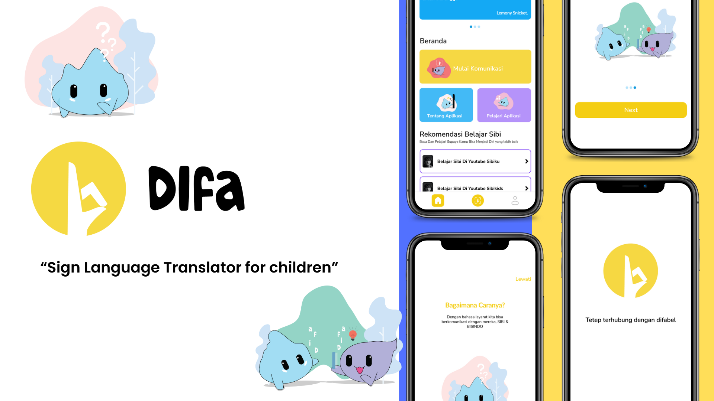

<!-- PROJECT LOGO -->
 

  

  <h3 align="center">Difa App</h3>

  

 Sign Language Translator for children,
   This is a project to fulfill the  <a href="https://grow.google/intl/id_id/bangkit/"><strong>Bangkit Academy led by Google, Tokopedia, Gojek, & Traveloka »</strong></a>
   Program.
     
    <a href="https://docs.google.com/document/d/1rprA--jp16v7KTmPdvtAMcazYzfeCDyErdVm0oMtP3U/edit"><strong>Explore the docs »</strong></a>
     
     
    <a href="https://youtu.be/pOAWBpWwvy4">View Demo</a>
    ·
    <a href="https://bit.ly/Slides_Difa">Slide Pressentation</a>
    ·
    <a href="https://github.com/DifaApp/issues">Request Feature</a>
  

<!-- TABLE OF CONTENTS -->

  
Table of Contents

  <ol>
    <li><a href="#background-the-Project">Background the Project</a>
    </li>
    <li><a href="#getting-started">Getting Started</a></li>
    <li><a href="#our-team">Our Team</a></li>
  </ol>

<!-- ABOUT THE PROJECT -->

## Background the Project

Bullying cases in the environment often occur. Data released by the Indonesian Teachers' Union Federation has released data on bullying cases in 2023 from January to September. handicapped or disabled, including those who are speech impaired, they are unable to communicate like other students even though communication is very important. The way to overcome this is actually to send children with disabilities to special schools (SLB), but problems arise if students who have these disabilities go to conventional schools where the majority of other students communicate normally using their mouths, but students with speech impairments can only communicate using sign language. so this can make things difficult for other students and can also become a source of insults and targets for student bullying.
to overcome this we created "DiFA" a sign language translator application by detecting movements from the hands of the SIBI sign language "Indonesian Sign system", using an Image recognition system using the transfer learning algorithm () to detect images of hand movements so that users can translate his speech impaired friend's hand movements in real life using a camera so that non-speech students can understand what the speech impaired students are saying without having to first understand the sign language system
With this application, we hope that there will be no more bullying that happens to students with speech impairments and also that other children can better understand what is being communicated by students with speech impairments, which can be understood by both students and teachers, thereby supporting a more inclusive world.

### Built With

- [Android](https://www.android.com/)
- [Kotlin](https://kotlinlang.org/)
- [Tenserflow Lite](https://www.tensorflow.org/lite)
- [Express Js](https://expressjs.com/)
- [Firebase authentication](https://firebase.google.com/docs/auth)
- [Mysql](https://www.mysql.com/)
- [Compute Engine](https://cloud.google.com/compute)

### Repository

1. [Difa Mobile App](https://github.com/DifaApp/MD-Difa-App)
2. [Difa Beckend](https://github.com/DifaApp/CC-Difa-App) 
3. [Difa ML](https://github.com/DifaApp/ML-Difa-App)

<!-- GETTING STARTED -->

## Getting Started

### Installation

1. Download Guifena Application [Download](https://drive.google.com/drive/folders/1vidLtpc_VzO0H7Hc_ZkbFO4pSXJy7eoA?usp=sharing)
2. Install on your Android devices.
3. Sign Up using Google Accoun or create new account
4. Sing In and home will displayed the main content 
5. after sign in you must update profile in profile page, if you using google account this step is optional
6. and then you can detection sign languange

<!-- OUR TEAM -->

## Our Team

| Name | Bangkit ID | Role |Github Profile |
| ------ | ------ | ------ | ------ |
Fikri Pratama AL Fajri | M156BSY1128 | ML & PM | https://github.com/ichigoseira 
Alfariza Ramadhan | M229BSY1480 | ML | https://github.com/Alfariza123 
Farian Halim Wicaksono | M121BSY0941 | ML | https://github.com/lieutenantcolonenwar2
Muhammad Nabil Hatami | C274BSY3350 | CC | https://github.com/nabilhatami86
Reynaldi Gunawan | C274BSY3687 | CC | https://github.com/B1N0Y 
Rakha Agus Maulana | A156BSY2597 | MD | https://github.com/rakaagus
